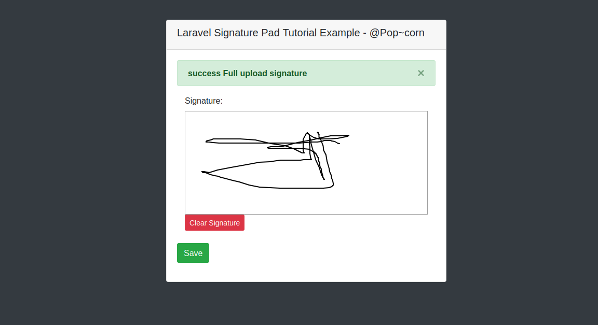

# Implement digital signature in laravel

Hello all! In this article, we will talk about laravel signature pad example. We will use signature pad in laravel. if you have question about jquery signature pad canvas image laravel then i will give simple example with solution. if you want to see example of laravel e-signature then you are a right place.

## Preview:


## Step 1: Install Laravel

first of all we need to get fresh Laravel application using bellow command, So open your terminal OR command prompt and run bellow command:

```php
    composer create-project --prefer-dist laravel/laravel blogFirebase
```


## Step 2: Create Route

In this is step we need to add route for generate view and submit post method. so open your route file and add following route.

`routes/web.php`

```php
    <?php

  

    use Illuminate\Support\Facades\Route;

    

    use App\Http\Controllers\SignaturePadController;

    

    /*

    |--------------------------------------------------------------------------

    | Web Routes

    |--------------------------------------------------------------------------

    |

    | Here is where you can register web routes for your application. These

    | routes are loaded by the RouteServiceProvider within a group which

    | contains the "web" middleware group. Now create something great!

    |

    */

    

    Route::get('signaturepad', [SignaturePadController::class, 'index']);

    Route::post('signaturepad', [SignaturePadController::class, 'upload'])->name('signaturepad.upload');
```

## Step 3: Create Controller

If you haven't HomeController then we should create new controller as SignaturePadController in that file we will add two methods, index() and upload(), so put bellow content in controller file:

`app/Http/Controllers/SignaturePadController.php`

```php
    <?php

  

    namespace App\Http\Controllers;

    

    use Illuminate\Http\Request;

    

    class SignaturePadController extends Controller

    {

        /**

        * Write code on Method

        *

        * @return response()

        */

        public function index()

        {

            return view('signaturePad');

        }

    

        /**

        * Write code on Method

        *

        * @return response()

        */

        public function upload(Request $request)

        {

            $folderPath = public_path('upload/');

            

            $image_parts = explode(";base64,", $request->signed);

                

            $image_type_aux = explode("image/", $image_parts[0]);

            

            $image_type = $image_type_aux[1];

            

            $image_base64 = base64_decode($image_parts[1]);

            

            $file = $folderPath . uniqid() . '.'.$image_type;

            file_put_contents($file, $image_base64);

            return back()->with('success', 'success Full upload signature');

        }

    }   
```

## Step 4: Create View File

In last step, we have to create view file "signaturePad.blade.php" for generate view signature pad, so create signaturePad file and put bellow code:

`resources/view/signaturePad.blade.php`

```php

    <html>

    <head>

        <title>Laravel Signature Pad Tutorial Example - ItSolutionStuff.com </title>

        <link rel="stylesheet" type="text/css" href="https://cdnjs.cloudflare.com/ajax/libs/twitter-bootstrap/4.3.1/css/bootstrap.css">

    

        <script type="text/javascript" src="http://ajax.googleapis.com/ajax/libs/jquery/1.12.4/jquery.min.js"></script> 

        <link type="text/css" href="http://ajax.googleapis.com/ajax/libs/jqueryui/1.12.1/themes/south-street/jquery-ui.css" rel="stylesheet"> 

        <script type="text/javascript" src="http://ajax.googleapis.com/ajax/libs/jqueryui/1.12.1/jquery-ui.min.js"></script>

        <script type="text/javascript" src="http://keith-wood.name/js/jquery.signature.js"></script>

    

        <link rel="stylesheet" type="text/css" href="http://keith-wood.name/css/jquery.signature.css">

    

        <style>

            .kbw-signature { width: 100%; height: 200px;}

            #sig canvas{

                width: 100% !important;

                height: auto;

            }

        </style>

    

    </head>

    <body class="bg-dark">

    <div class="container">

    <div class="row">

        <div class="col-md-6 offset-md-3 mt-5">

            <div class="card">

                <div class="card-header">

                    <h5>Laravel Signature Pad Tutorial Example - ItSolutionStuff.com </h5>

                </div>

                <div class="card-body">

                        @if ($message = Session::get('success'))

                            <div class="alert alert-success  alert-dismissible">

                                <button type="button" class="close" data-dismiss="alert">×</button>  

                                <strong>{{ $message }}</strong>

                            </div>

                        @endif

                        <form method="POST" action="{{ route('signaturepad.upload') }}">

                            @csrf

                            <div class="col-md-12">

                                <label class="" for="">Signature:</label>

                                <br/>

                                <div id="sig" ></div>

                                <br/>

                                <button id="clear" class="btn btn-danger btn-sm">Clear Signature</button>

                                <textarea id="signature64" name="signed" style="display: none"></textarea>

                            </div>

                            <br/>

                            <button class="btn btn-success">Save</button>

                        </form>

                </div>

            </div>

        </div>

    </div>

    </div>

    <script type="text/javascript">

        var sig = $('#sig').signature({syncField: '#signature64', syncFormat: 'PNG'});

        $('#clear').click(function(e) {

            e.preventDefault();

            sig.signature('clear');

            $("#signature64").val('');

        });

    </script>

    </body>

    </html>
```

Now you can run project using following command:

```php
    php artisan serve
```